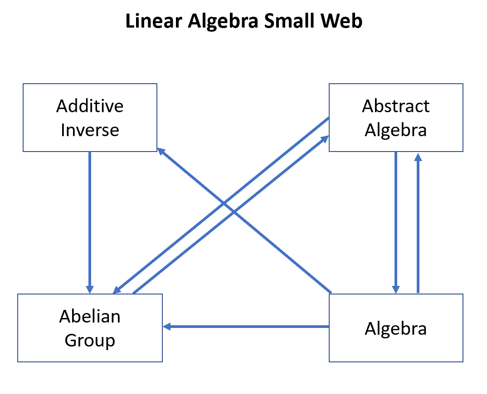
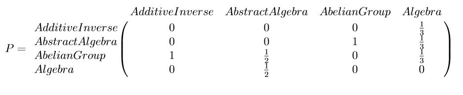
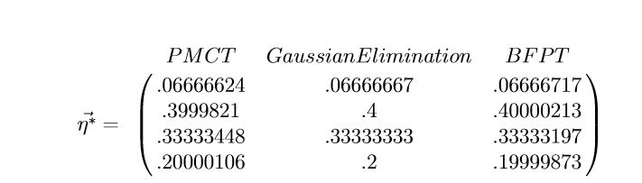
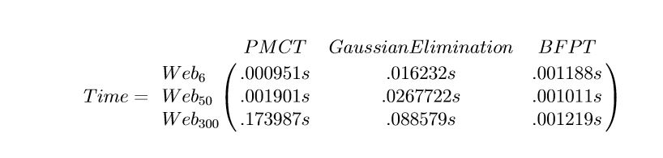

# Wikiepdia-Seach-Google-Page-Rank
Uses Google's original page rank algorithm using wikiepdia links to determine what would be the search results given a specific Wikipedia page.
As everyone who uses wikipedia knows, wikipedia pages have links to other wikipedia articles that are relevant to the topic. The purpose of 
this code is to find out page links is the most relevant. 

## This is done in three steps. 

## The first step is to create a web based on the pages linked.
Here is an example of the wikipedia page "Linear algebra" with a webspace of 4 page links.

(Note: The web does not include the page "Linear algebra" since it is the orignal page and we want to find out which page link is the most
relevant)

Here each node represents a wikipedia page that is linked to by the "Linear algebra" page and each edge represents a link to that page.
For example, the page "Algebra" has web page links to every other link in the web but only "Abstract algebra" links back to "Algebra".
(Note: A web page can not be a disconnect node, meaning it has not links to any other page if this occurs we throw out that node. 
It is possible to consider a disconnected node but the problem becomes much more complex.)

## Step 2 Create Transition Probability Matrix (TPM) from the web.
 
Each column must add up to 1 and the value inside each element of the matrix represents where outward edges point towards.

## Step 3. Use 3 methods to find the importance value of each page.

### 1. Is the Power Method Convergence Theorem (PMCT). 
The idea is to multiply the matrix by itself many times until each column has the same value.
That column approximates the unique eigen vector associated with the eigen value of 1 which tells us the importance of each page.
This is the simpliest implementation but also the slowest.

### 2. Guassian Elimination.
This method solves for the eigen vector associated with the eigen value equal to 1 for the matrix. This method gives the most percise answer
however,  the computation is expensive and is slow.

### 3. Banachs Fixed Point Theorem (BFPT)
This method we create a vector c that start intially is c=(first row of the TPM/row length of TPM). We then recusicely update this n
value by letting n equal the dot product between TPM and n. This approximates the importance ranking just like PMCT but much faster. 
This method is bar far the most efficient.

If you want more information on all three methods plase read the paper my colleagues and I created. Located in the paper folder.

## Implementation of all three methods
 

For our Linear Algebra example then, the most relevant page is Abstract algebra.

## Time taken for all three methods
 

As we can see. From a web size of 6 to 300, the time PMCT took increase by a factor of 180 times! Guassian elimination increase by a factor
of 5. BFPT did not even have a factor increase!

## With a websize of 300. The most relevant links with Linear algebra are:

1. Bibliotheque France
2. Library of Congress Control Number
3. Integrated Authority File
4. International Standard Book number
5. National Diet Library
6. Mechanics
7. Matrix Decomposition
8. Gram-Schmidt process

As you see, **the first 5 webpages are not related with Linear Algebra. This is due to the fact that the first 5 links are historical libraries,
that have thousands of web pages link back towards the page since many historical mathmatical ideas are held inside famous libraries. This is an example
of link farming.** 
This inflated value by having many websites link back to a specific websites shows a weakness in the code and this weakness was taken advantage of
by link farmers. In the early 2010's Google cracked down on websites that used leak farming by creating many fake websites with links
back to one website.

The links after the first 5 however are all very relevant towards linear algebra, with much of mechanics using linear algebra to solve problems.
**Matrix decompostion such as QR factorization, SVD or Gram_Schmidt are concepts that are crucial to linear algebra. Meaing, the code is 
a success at figuring out relevant web pages!**

